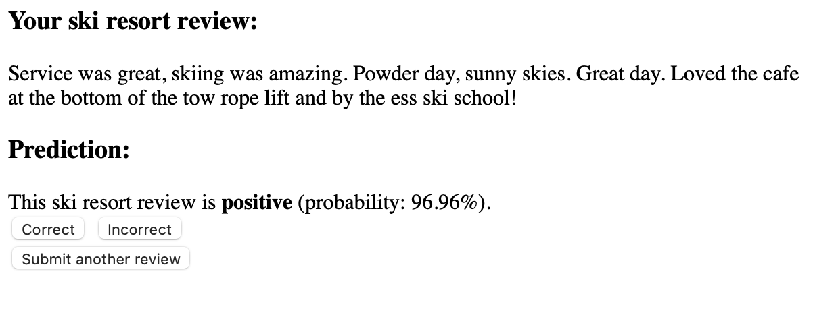
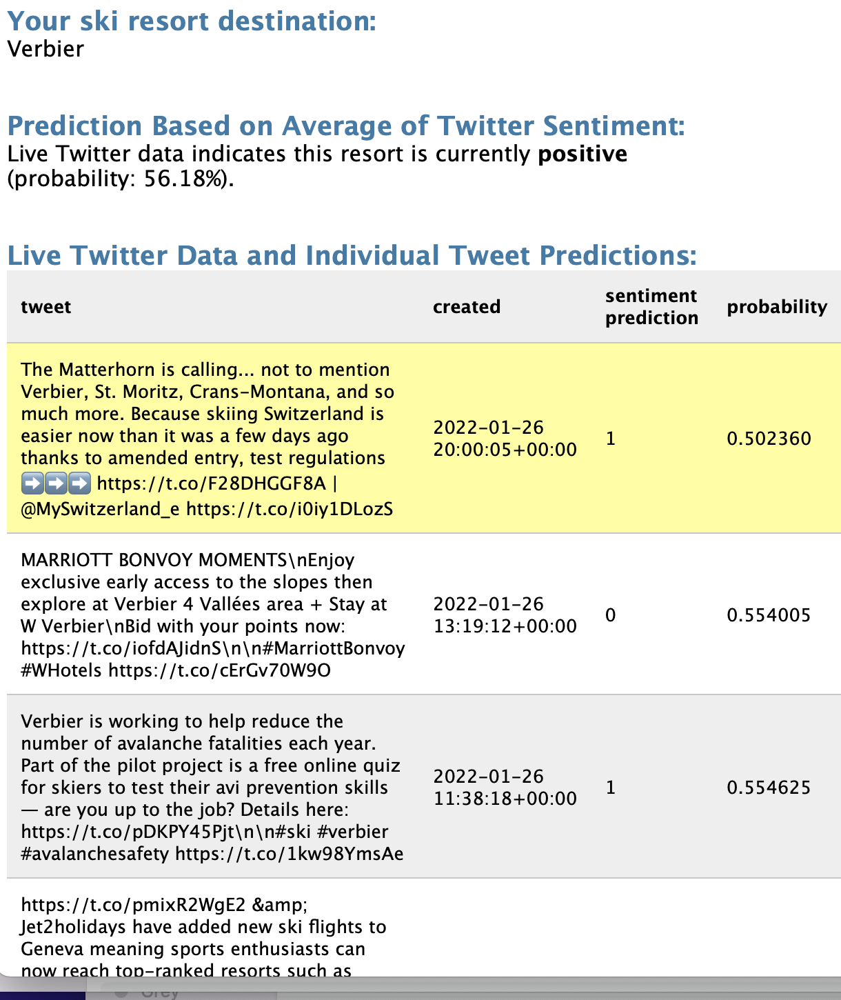

### ski_resorts

This project is a personal learning project that explores sentiment analysis.

- WebApp1 ResortClassifer - The webapp takes text input and predicts the sentiment. There is a sqlite db and user feedback correct/incorrect on the prediction and online training based on the feedback
- WebApp2 Resort_Sentiment_Twitter - The webapp takes a ski resort text input, pulls live twitter data mentioning the resort, then predicts the sentiment based on an average of recent tweets.

   
### Notebooks:
- IMDB Movie Review Data Save CSV - saves the csv file from raw data (https://ai.stanford.edu/~amaas/data/sentiment/)
- IMDB Movie Review Data Explore Text - exploring text concepts and training a logistic regression (scikit learn) model
- IMDB Movie Review 'out of coure' - training a model using stochastic gradient descent, partial fit, batches, exporting a pickle file fo the model and initializing an sqlite db for the webapp
